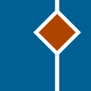

# PCLMock

## What?
 
PCLMock is a simple mocking framework in a Portable Class Library. The PCL targets a wide range of platforms including:

* .NET 4.5
* Windows 8
* Windows Store
* Windows Phone 8
* Xamarin iOS
* Xamarin Android.

## Why?

Existing mocking frameworks, such as [Moq](https://github.com/Moq/moq4), do not work on platforms running a limited subset of the .NET framework. Writing mocks without the aid of a framework is laborious, error-prone, and results in inconsistent code. PCLMock aims to reduce this pain.

## Where?

The easiest way to get PCLMock is via [NuGet](http://www.nuget.org/packages/Kent.Boogaart.PCLMock/):

```PowerShell
Install-Package Kent.Boogaart.PCLMock
```

## How?

Mocks must be created manually (or by code generation). Mocks are created by subclassing `MockBase<T>`, where `T` is the interface or non-`sealed` class being mocked. For example:

```C#
public class SomeServiceMock : MockBase<ISomeService>, ISomeService
{
    // implementation code goes here
}
```

For a detailed discussion, read the documentation on [defining mocks](Doc/defining-mocks.md).

Test code can utilize the defined mocks in various ways. Here is a typical example:

```C#
[Fact]
public void some_test()
{
    var mockService = new SomeServiceMock();
	mockService.When(x => x.Login(It.IsAny<string>(), "123456"))
	           .Return(true);

    var sut = new Foo(mockService);

    // other test code follows
}
```

For a detailed discussion, read the documentation on [using mocks](Doc/using-mocks.md).

## Who?

PCLMock is created and maintained by [Kent Boogaart](http://kent-boogaart.com).